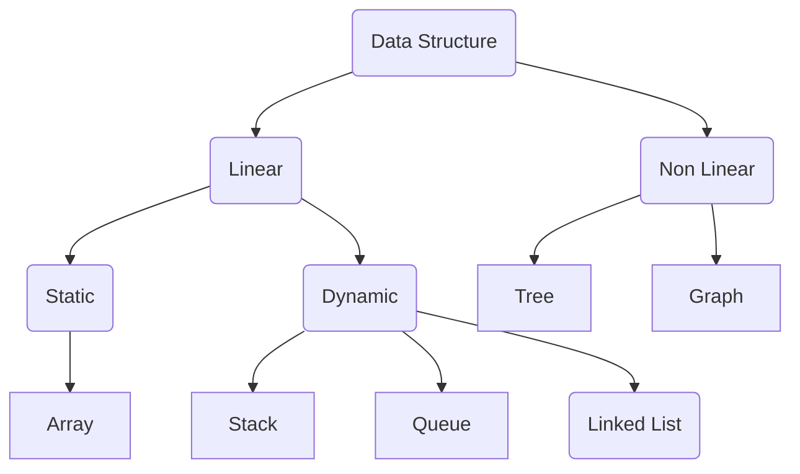

# dsa
Data Structures &amp; Algorithms - For Competitive Programmer

## 1. Data Structures

Data Structures are used for organizing data in computer's memory so that it can be stored, retrieved and processed efficiently.

### 1.1 Classification of Data Structures

